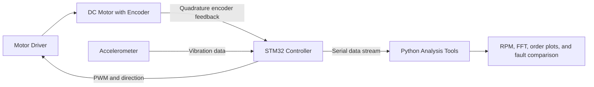

# Motor Vibration Diagnostics and Motion-Control Test Platform

An in-development embedded test platform for characterizing vibration in a small rotating machine. The project combines an encoder-equipped DC motor, a purchased motor driver, an STM32 microcontroller, MEMS acceleration sensing, and Python analysis tools.

The platform will control motor speed, measure actual shaft speed with quadrature-encoder feedback, collect synchronized vibration data, and compare healthy operation against controlled mechanical conditions such as imbalance, loose mounting, and rubbing. The goal is not to claim universal fault diagnosis; it is to detect and explain measurable changes from a healthy baseline under repeatable test conditions.

## Why This Project

This project is a learning-focused bridge between embedded systems, motion control, test engineering, and signal processing. It develops skills that transfer directly to the larger energy-aware rover while remaining a complete project on its own.

## Learning Objectives

- Write STM32 firmware in C for GPIO, timers, PWM, interrupts, I2C/SPI, and serial communication
- Command a DC motor through a purchased motor driver using PWM and direction signals
- Read a quadrature encoder and calculate shaft speed in RPM
- Implement and tune a basic closed-loop PID speed controller
- Acquire accelerometer data at a defined sample rate and understand sampling, aliasing, and noise
- Use Python to clean, log, plot, and analyze time-domain vibration data
- Compute FFT spectra and order-based vibration plots using measured shaft speed
- Design repeatable tests, compare healthy and faulted conditions, and document conclusions with data

## System Architecture

## Planned Demonstration

1. Command the motor to several target speeds.
2. Use encoder feedback to measure actual RPM and hold each speed with closed-loop control.
3. Record accelerometer data at each operating point.
4. Establish a healthy vibration baseline.
5. Introduce one controlled condition at a time, such as a small imbalance mass, loosened mount, or safe rubbing contact.
6. Use Python to compare time traces, FFT spectra, and vibration orders.
7. Explain which vibration features changed and how they relate to shaft speed.

## Key Measurements

| Measurement | Why it matters |
|---|---|
| Commanded motor speed | Reference requested by the controller |
| Encoder-derived RPM | Actual mechanical speed used for feedback and analysis |
| PWM duty cycle | Approximate motor-drive effort needed to hold speed |
| Acceleration versus time | Raw vibration behavior |
| Frequency spectrum | Identifies vibration peaks in hertz |
| Order plot | Relates vibration peaks to shaft speed, such as 1× or 2× rotational frequency |

## Project Milestones

1. Build and flash a basic STM32 project; verify GPIO and serial output.
2. Drive the motor safely with PWM and direction control.
3. Read the encoder and calculate RPM.
4. Close the speed loop with a basic PID controller.
5. Read and log accelerometer samples.
6. Build Python plots and FFT analysis.
7. Collect healthy and controlled-fault datasets at repeatable speeds.
8. Create a final test report and demonstration video.

## Scope and Safety

- Use a low-voltage motor and a purchased, appropriately rated motor driver.
- Use guards and secure mounting around rotating parts.
- Introduce only controlled, reversible mechanical conditions.
- Stop the motor before changing the fixture, sensor mount, or fault condition.
- Begin with development boards and breakout modules; design a compact custom sensor/controller PCB only after the prototype is proven.
